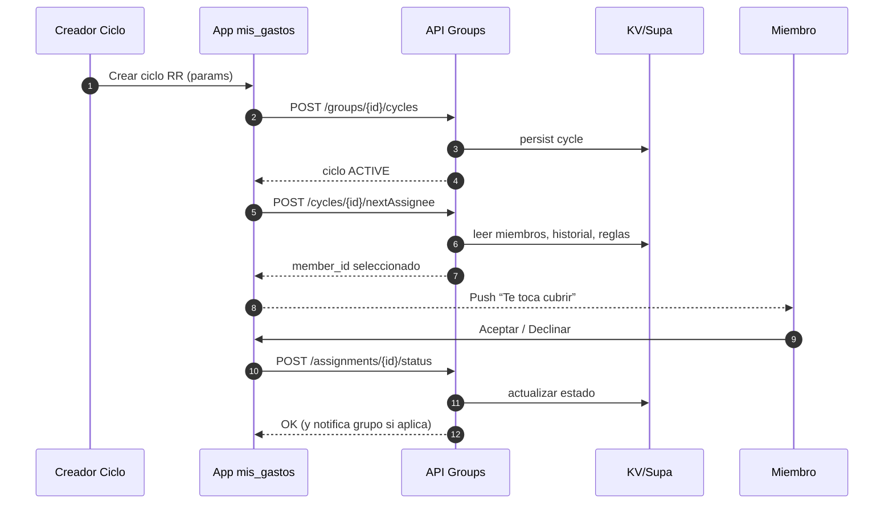

# Requerimientos actualizados (v0.2)

## 1) Objetivo del producto

* Registrar gastos vía **Share → OCR on-device → DB local** (costo ≈ 0).
* **Gasto compartido simple**: quien paga comparte con 3–4 personas para que importen el gasto.
* **Round-Robin Colaborativo**: en grupos de 20–30, rotar “quién paga” o “quién colabora” para que no recaiga siempre en los mismos.

---

## 2) Reglas de negocio

* **Umbral mínimo** para compartir: no mostrar opción si **monto < S/3** (configurable).
* **Gasto compartido**:

  * Usuarios existentes → **push** con botón **Importar**.
  * No usuarios → **deep link** por WhatsApp/SMS (landing ultra-ligera).
* **Round-Robin**:

  * Cada **ciclo** define 1 o más eventos (p. ej., “snacks del viernes”, “taxi del equipo”).
  * El **siguiente responsable** se elige por rotación justa:

    * Se usa una **cola circular** de miembros activos.
    * Se **saltan** miembros en **cooldown** o con límite de aportes en el período.
    * Se registra el **historial** para auditar y evitar repeticiones cercanas.
  * Opcional: **peso** por participación anterior (dar chance a quien aportó menos).
  * Tolerar **excepciones**: si el asignado rechaza o no puede, se reasigna al siguiente.

---

## 3) Arquitectura (añadidos)

### Mobile (offline-first)

* OCR on-device (ML Kit / Tesseract).
* DB local Drift/SQLite + FTS5.
* Módulo **Shares** (enlace firmado + importación).
* Módulo **Groups & Round-Robin** (caché local + sync liviana).

### Backend mínimo (serverless, free tier)

* **/share/**: creación/aceptación de gastos compartidos.
* **/groups/**: creación de grupo, alta/baja de miembros, **rotación** y **ciclos**.
* **/push/**: FCM para notificaciones (gratis).
* Storage: **KV/Supabase** con TTL para tokens.

> Nota costo: seguimos usando on-device para OCR y solo persistimos **metadatos ligeros** de grupos/rotaciones. Todo lo pesado (imágenes, OCR, búsqueda) sigue local.

---

## 4) Modelo de datos (nuevas tablas)

**groups**

* id (uuid, PK), name, description, created\_at

**group\_members**

* id (uuid, PK), group\_id (FK), user\_id (FK o null si invitado por teléfono), phone/email, is\_active (bool), role (“owner”, “member”), weight (int default 1), cooldown\_until (epoch ms)

**rr\_cycles** (ciclos de round-robin)

* id (uuid, PK), group\_id (FK), name (“Snacks Q3”), period (“WEEKLY|MONTHLY|ADHOC”), start\_at, end\_at (nullable), max\_contrib\_per\_period (int), status (“ACTIVE|PAUSED|ENDED”)

**rr\_assignments** (historial/asignaciones)

* id, cycle\_id (FK), member\_id (FK), due\_date, status (“ASSIGNED|DECLINED|DONE|SKIPPED”), reason (nullable), created\_at

**shared\_expenses** (ya contemplado)

* id, owner\_user\_id, expense\_payload (json compacto), token (short), expires\_at, created\_at

**push\_devices**

* id, user\_id, device\_token, platform, updated\_at

> En el cliente seguimos con `captures`, `expenses`, `categories`, `attachments`.

---

## 5) Lógica de Round-Robin (algoritmo)

### Parámetros

* **M** = miembros activos del grupo con `is_active = true`.
* **Historial ventana**: evitar repetir a un miembro que **ya fue asignado** en las últimas **K** rondas (configurable, p. ej. K = 3).
* **Cooldown**: `member.cooldown_until > now` → saltar.
* **Límite por período**: si `assignments(DONE) >= max_contrib_per_period`, saltar.

### Selección (pseudocódigo)

```
function nextAssignee(groupId, cycleId, date):
  active = miembros_activos(groupId)
  queue = ordenar_por_ultima_participacion(active)  // menos recientes primero
  queue = aplicar_pesos(queue)                      // opcional, repetir miembro con menos aportes
  for member in queue.ciclo():
    if member.cooldown_until > now: continue
    if hizo_maximo_en_periodo(member, cycleId, date): continue
    if fue_asignado_en_ultimas_k(member, cycleId, K): continue
    return member
  return first(active) // fallback
```

### Estados y transiciones

* **ASSIGNED** → (usuario acepta y paga) → **DONE**
* **ASSIGNED** → (declina) → **DECLINED** → reasignar `nextAssignee()`
* **ASSIGNED** → (timeout X horas) → **SKIPPED** → reasignar

> Todo cambio escribe un `rr_assignments` y dispara **push** a afectados.

---

## 6) UX / Flujo de usuario

### Compartir gasto (3–4 personas)

1. Desde el gasto → **Compartir**.
2. Seleccionar contactos (máx 4).
3. Enviar:

   * Usuarios app → **push** “Te compartieron un gasto”.
   * No usuarios → **deep link** para importar (abre app o landing).

### Round-Robin (20–30 personas)

1. Crear **Grupo** → invitar miembros.
2. Crear **Ciclo RR** (nombre, periodicidad, reglas).
3. La app muestra el **Próximo responsable** con fecha límite.
4. Botones:

   * **“Lo cubro”** → marca **DONE** y notifica al grupo.
   * **“No puedo”** → **DECLINED** → reasignación automática.
5. Historial visible por transparencia (quién aportó, cuándo).

> Regla de simplicidad: no se sugiere round-robin para montos **< S/3**.

---

## 7) Notificaciones y deep links

* **FCM**: `topic: group_{id}` para avisos generales + `device_token` por usuario.
* **Deep links**:

  * `mis_gastos://share/{token}` → importar gasto.
  * `mis_gastos://group/{id}/cycle/{cycleId}` → ver asignación actual/aceptar/declinar.

---

## 8) Seguridad y privacidad

* Tokens de **share** firmados y con **TTL** (7–14 días).
* Datos sensibles **en local**; backend guarda solo metadatos de grupos/rotaciones.
* Opt-in para mostrar **nombre** en historial del grupo (sino alias/emoji).
* Enlaces para no usuarios muestran **solo lo mínimo** (monto total, concepto, fecha).

---

## 9) Métricas locales (sin costo)

* % de gastos importados por invitados.
* Tiempo medio de resolución de una asignación RR.
* Distribución de aportes por miembro (equidad).
* Ratio de “declinados” por ciclo.

---

## 10) Roadmap

**v0.2 (esta iteración)**

* Tablas `groups`, `group_members`, `rr_cycles`, `rr_assignments`.
* UI Grupo: lista, detalle del ciclo, asignación vigente (aceptar/declinar).
* Selección de contactos para compartir (máx 4) + deep link.
* Reglas: umbral S/3, cooldown básico (48h), ventana K=3.

**v0.3**

* Pesos dinámicos (más turno a quien menos aportó).
* Panel de transparencia (top aportes, últimos 10).
* Export CSV por grupo/ciclo.

**v0.4**

* Reglas avanzadas (cap por mes, feriados, excepciones).
* Integración pagos (Yape/Plin) como comprobante (opcional).
* Admin web ligera (si hace falta).

---

## 11) Diagrama (Mermaid)

### Componentes con Round-Robin

```mermaid
flowchart LR
  subgraph Device (App)
    UI[UI mis_gastos]
    OCR[OCR Engine]
    Parser[Parser]
    DB[(Drift/SQLite)]
    Shares[Shares Module]
    Groups[Groups & RR Module]
  end

  subgraph Serverless (Free tier)
    API[/Share & Groups API/]
    KV[(KV/Supabase)]
    Push[FCM]
    Landing[Mini Landing]
  end

  UI -- "Share image" --> OCR --> Parser --> DB
  UI -- "Compartir gasto" --> Shares --> API
  API --> KV
  API --> Push
  UI <-- "push/import" --> Push
  Landing <-- deep link --> UI

  UI -- "Crear grupo/ciclo" --> Groups --> API --> KV
  UI <-- "asignación RR" --> API
```

### Secuencia Round-Robin



---

## 12) Validaciones y edge cases

* Grupo con <3 miembros: avisar que **RR pierde sentido**.
* Todos en cooldown/límite: **reset** ventanas y elegir menos reciente.
* Miembro sin app y sin teléfono válido: marcar **PENDING\_CONTACT**.
* Decline en cadena (3+): alertar al grupo/owner para intervención manual.
* Importación de gasto duplicado: **hash** del payload para dedup local.

---

Si quieres, te preparo el **esqueleto de DB Drift** (tablas nuevas + DAOs) y el **servicio RR** con la función `nextAssignee()` en Dart para que lo pegues directo en tu proyecto.
